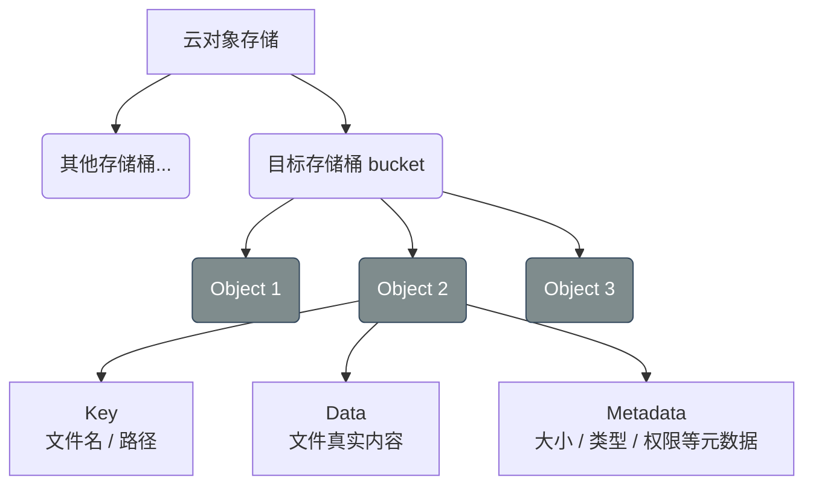
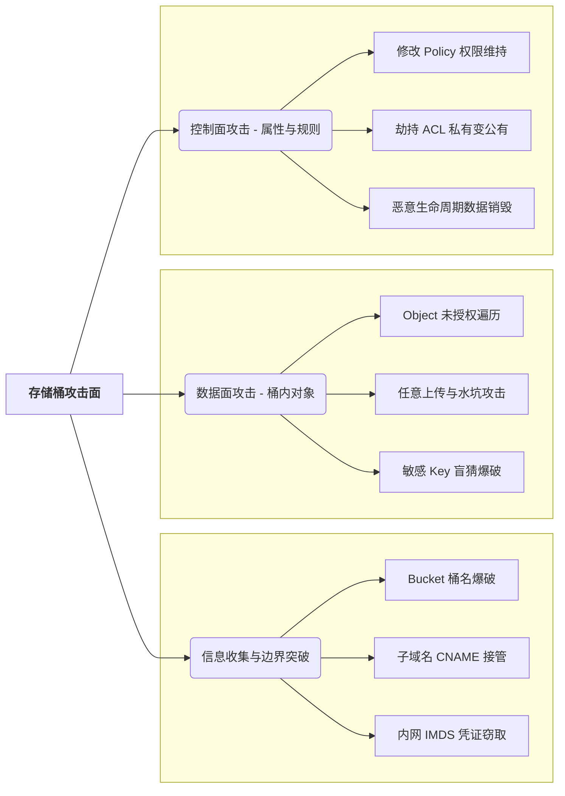

+++
date = '2026-05-18T19:50:15+08:00'
draft = false
title = 'Bucket Attack and Defense'

+++

# 对象存储

存储桶是对象存储服务中的一个概念,简单来说就像一个网盘用来存储文件,图片等资源.不同的厂商名字不同但本质是一个东西

- **AWS (亚马逊云):** Amazon S3 (Simple Storage Service)
- **阿里云:** OSS (Object Storage Service)
- **腾讯云:** COS (Cloud Object Storage)
- **华为云:** OBS (Object Storage Service)

### 存储桶的优点

1. 弹性容量: 根据所使用的实际大小收费
2. 支持高并发高可用
3. 自带网络属性: 每一个存储进存储桶的文件只要配置为**公开**.就会生成一个公网的url

## 存储桶的结构



对象存储中可以有多个桶,然后把对象 (Object) 放在桶中,对象又包含`key`,`Data`和`Metadata`

#### Bucket:

存储空间（Bucket）是用户用于存储对象（Object）的容器.所有对象都必须属于某个存储空间,存储空间具有各种属性(地域,访问权限,存储类型等). 使用者根据实际需求创建不同类型的存储空间存储不同的数据

1. 同一个存储空间的内部是扁平的，没有文件系统的目录等概念，所有的对象都直接隶属于其对应的存储空间。
2. 每个用户可以拥有多个存储空间。
3. 存储空间的名称在 OSS 范围内必须是全局唯一的，一旦创建之后无法修改名称。
4. 存储空间内部的对象数目没有限制。

#### Object:

对象（Object）是 OSS 存储数据的基本单元，也被称为 OSS 的文件。对象由元信息（Object Meta），用户数据（Data）和文件名（Key）组成，并且由存储空间内部唯一的 Key 来标识.

如果你上传了一个文件，指定它的 Key 为 `uploads/2026/images/avatar.png`这个文件的 Key 就是 `uploads/2026/images/avatar.png`。

# 利用姿势

## Object遍历(对象遍历)

在存储桶中,如果存储桶的权限被配置成**公共读**并且没有限制**ListBucket(列举存储桶)**,当直接访问根URL就会直接以XML格式返回桶中的全部信息

## AK/SK 遍历

有时候，存储桶虽然没有对公网开放 `Public-Read`，页面访问返回 403。但攻击者通过其他漏洞（如前端 JS 泄露、反编译 App、小程序、或者配置不当的后台报错）拿到了企业的 **AccessKeyID / SecretAccessKey (AK/SK)**。那么这时候就已经拿到了这个用户的身份凭证(具体操作需要看这组AK/SK的权限)

## Bucket 爆破

当不知道 Bucket 名称的时候，可以通过爆破获得 Bucket 名称，这有些类似于目录爆破，只不过目录爆破一般通过状态码判断，而这个通过页面的内容判断。

各大厂商命名规则:

阿里OOS: 

```
命名规则：
字符限制： 只能包含 小写字母、数字、中划线（-）。
开头/结尾： 必须以小写字母或数字开头和结尾。
长度限制： 3 ~ 63 个字符。
唯一性： OSS 范围内全局唯一。这意味着如果别人注册了 test，全阿里云任何人在任何地域都不能再叫 test。

默认 URL 格式：
https://[bucket-name].oss-[region].aliyuncs.com
示例： https://h4xk0r-prod-data.oss-cn-beijing.aliyuncs.com
```

腾讯云 COS:

```
命名规则：
字符限制： 只能包含 小写字母、数字、中划线（-）。
开头/结尾： 必须以小写字母或数字开头和结尾。
长度限制： 用户自定义部分最大支持 50 个字符。
唯一性： 加上系统自动附带的 AppID 后全局唯一。
特殊格式： 最终桶名自动体现为 [用户自定义名称]-[AppID]（AppID 是一串 10 位左右的数字，如 1250000000）。

默认 URL 格式：
https://[bucket-name]-[appid].cos.[region].myqcloud.com
示例： https://h4xk0r-static-1258888888.cos.ap-shanghai.myqcloud.com
```

 华为云 OBS:

```
命名规则：

字符限制： 只能包含 小写字母、数字、中划线（-）、点（.）。
开头/结尾： 必须以小写字母或数字开头和结尾。
长度限制： 3 ~ 63 个字符。
唯一性： OBS 范围内全局唯一。

默认 URL 格式：
https://[bucket-name].obs.[region].myhuaweicloud.com
示例： https://company-backup.obs.cn-north-4.myhuaweicloud.com
```

亚马逊 AWS S3

```
命名规则：
字符限制： 只能包含 小写字母、数字、中划线（-）、点（.）。
开头/结尾： 必须以字母或数字开头和结尾。
特殊限制： 不能包含两个相邻的点（如 ..）；不能格式化为 IP 地址（如 192.168.5.4）。
唯一性： 全球 S3 范围内全局唯一（在一个分区/Partition内）。

默认 URL 格式：
AWS S3 支持两种 URL 样式：
虚拟主机式（现版）： https://[bucket-name].s3.[region].amazonaws.com
路径式（旧版）： https://s3.[region].amazonaws.com/[bucket-name]
示例： https://target-logs-storage.s3.us-east-1.amazonaws.com
```

谷歌云 GCS 

```
命名规则：

字符限制： 只能包含 小写字母、数字、中划线（-）、下划线（_）、点（.）。（注意：GCS 是极少数允许下划线的主流厂商，但带点的桶名通常需要通过网域验证）。
长度限制： 3 ~ 63 个字符（如果包含点，最多可达 222 个字符）。
唯一性： 全球范围内全局唯一。

默认 URL 格式：
https://[bucket-name].storage.googleapis.com （不带 region）
或者通过 API 路径访问：https://storage.googleapis.com/[bucket-name]/
```

#### 存储桶报错信息`<code>`

- AccessDenied：存在存储桶，但无权限访问
- InvalidBucketName：表示存储桶的名称不符合规范，属于无效的存储桶名称
- NoSuchBucket：表示不存在这个存储桶

## 任意文件上传与覆盖

如果在配置存储桶时，管理员错误的将存储桶权限，配置为可写，这将会导致攻击者可上传任意文件到存储桶中，或覆盖已经存在的文件

#### 测试方式:

```
PUT /1.txt HTTP/1.1
HEAD
123
```

#### **攻击方向**

**钓鱼,挂黑页,挂暗链**

**存储型 XSS:**

- 1. 当攻击者构造一个HTML页面时包含恶意JS脚本,由于存储桶带公网URL,当其他用户或者管理员访问时就会造成存储型XSS
- 2. 如果网站把JS放在存储桶中,那么一旦被攻击者覆盖依然会造成XSS

**供应链污染:**如果放置的是APP升级固件,攻击者增加后门后进行替换就会造成供应链污染

## 存储桶接管

当访问存储桶出现`<code>`为NoSuchBucket,就说明存在存储桶接管

## Bucket Policy 修改

**注:** 不要和任意文件上传覆盖混为一谈

**文件上传与覆盖：** 攻击的是存储桶里的**数据（Data）**，也就是桶内的对象（Object）。
**Bucket 可修改（修改 Policy）：** 攻击的是存储桶本身的**属性与规则（Control Plane / 控制面）**。

**危害:**

- 制造勒索或拒绝服务攻击
- 进行权限维持插入后门
- 横向
- ....

## ACL劫持

如果攻击者拿到的临时凭证或 AK/SK 拥有 `PutBucketAcl` 权限，他们可以发起一个简单的 API 请求，直接将一个原本是 `Private`（私有加密）的存储桶，权限变更为 `Public-Read`直接进行托库

## 获取本地凭证横向

**原理：** 云服务器通常可以绑定一个“IAM 角色（Role）”，让服务器里的程序不需要写死 AK/SK 就能直接读写存储桶。服务器是通过访问一个内部固定的虚拟 IP（`169.254.169.254`，即元数据服务）来实时获取临时 Token

**条件:**已经拿到shell

**利用:**

进入服务器后，直接执行 `curl http://169.254.169.254/latest/meta-data/iam/security-credentials/[角色名]`
查看 `~/.aws/credentials` 或 ` ~/.ossutilconfig`等文件

## 滥用生命周期

**原理：** 存储桶有一个功能叫“生命周期管理”，比如可以配置“超过 30 天的文件自动删除或转为冷存储”以节省成本

如果将其改为一天,就会造成书丢失,服务崩溃等

## 总结




------

“受限于个人水平，文中难免存在疏漏与错误。文笔粗浅、技术简陋，若有不足之处，恳请各位师傅批评指正，不吝赐教。感激不尽！”
