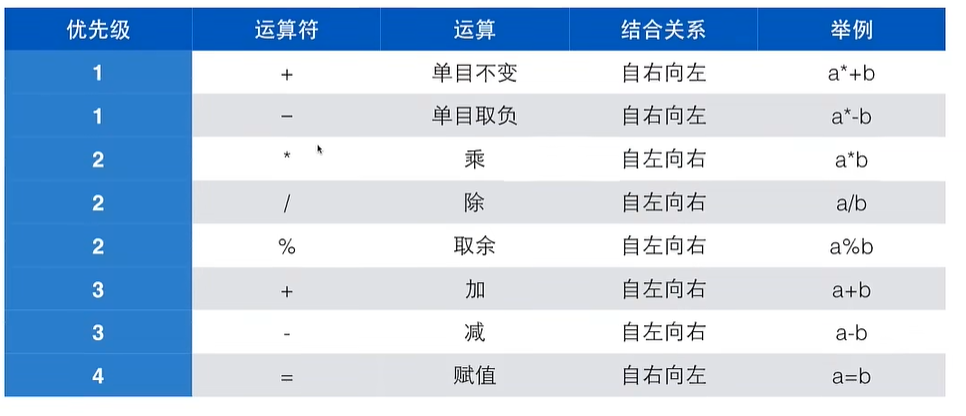

# C 语言 学习

学习c语言是为了后面学习免杀,记录一下学习过程方便温习

## 基础知识

#### 程序执行的两种方式:

- 解释: 借助一个程序,读懂你写的程序去执行
- 编译: 借助一个程序,把你的程序翻译成计算机懂得语言--机器语言--写的程序,然后执行(整体转换为机器码后，由系统直接调度执行)

### 整数类型

| 类型           | 存储大小    | 值范围                                               |
| :------------- | :---------- | :--------------------------------------------------- |
| char           | 1 字节      | -128 到 127 或 0 到 255                              |
| unsigned char  | 1 字节      | 0 到 255                                             |
| signed char    | 1 字节      | -128 到 127                                          |
| int            | 2 或 4 字节 | -32,768 到 32,767 或 -2,147,483,648 到 2,147,483,647 |
| unsigned int   | 2 或 4 字节 | 0 到 65,535 或 0 到 4,294,967,295                    |
| short          | 2 字节      | -32,768 到 32,767                                    |
| unsigned short | 2 字节      | 0 到 65,535                                          |
| long           | 4 字节      | -2,147,483,648 到 2,147,483,647                      |
| unsigned long  | 4 字节      | 0 到 4,294,967,295                                   |


一个demo:

```c
#define _CRT_SECURE_NO_WARNINGS	//因为scanf容易导致溢出为避免报错加一个宏
#include <stdio.h>

int main()
{
	int price = 0;
    const int AMOUNT = 100;		//定义常量

	printf("Enter you cash: ");
	scanf("%d",&price);	//&price是取price的地址的意思

	int change = AMOUNT - price;
	printf("找您%d元\n",change);
    
    return 0;
}

scanf的注意点,如:
scanf("%d %d",&a,&b)  
//那么输入的格式必须为`1空格1`,scanf里面是什么样,就必须输什么样,否则就会报错或者卡住
scanf("price%d %d",&a,&b) //必须输入price1 1  
```

 float_demo

```c
int main()
{
	double  foot;
	double  inch;

	scanf("%lf %lf", &foot,&inch);
	printf("身高是%f米,\n", (foot + inch / 12) * 0.3048);

	return 0;
}
```


| **变量类型**    | **描述**       | **scanf (输入)** | **printf (输出)** | **占用内存** |
| --------------- | -------------- | ---------------- | ----------------- | ------------ |
| **`int`**       | 整数           | `%d`             | `%d`              | 4 字节       |
| **`float`**     | 单精度小数     | `%f`             | `%f`              | 4 字节       |
| **`double`**    | **双精度小数** | **`%lf`**        | **`%f` 或 `%lf`** | **8 字节**   |
| **`char`**      | 单个字符       | `%c`             | `%c`              | 1 字节       |
| **`char[]`**    | 字符串         | `%s`             | `%s`              | 视长度而定   |
| **`long long`** | 超大整数       | `%lld`           | `%lld`            | 8 字节       |

Calculate the time difference demo

```c
int main()
{
	int hours, minutes;
	int hours1, minutes1;

	scanf("%d:%d", &hours, &minutes);
	scanf("%d:%d", &hours1, &minutes1);

	int t1 = hours * 60 + minutes;
	int t2 = hours1 * 60 + minutes1;

	int diff = t2 - t1;

	printf("时间差是%d小时%d分钟", diff/60,diff%60);
}

```

### 运算符优先级



### if判断

```c
int main()
{
	int hours, minutes;
	int hours1, minutes1;

	scanf("%d:%d", &hours, &minutes);
	scanf("%d:%d", &hours1, &minutes1);

	int t1 = hours * 60 + minutes;
	int t2 = hours1 * 60 + minutes1;

	int ih = hours1 - hours;
	int im = minutes1 - minutes;

	if (im < 0) {
		im = 60 + im;
		ih --;
	}

	printf("时间差是%d小时%d分钟",ih,im );

	return 0;

}
```

三个数最大值

```c
int main()
{
	int num1, num2, num3;
	int max;
	scanf("%d %d %d", &num1, &num2, &num3);

	if (num1 > num2) {
		if (num1 > num3) {
			max = num1;
		}else{
			max = num3;
		}

	}
	else {
		if (num2 > num3 ) {
			max = num2;
		}else {
			max = num3;
		}
	}
	printf("最大数是%d", max);

}
```

### switch-case

```c
int main()
{
    int type;
    scanf("%d", &type);

    switch (type) {			// switch类型只能是int
    case 1:
        printf("早上好\n");
        break;				//switch是一种基于运算的跳转,如果没有break他会继续运行下一个case
    case 2:
        printf("中午好\n");
        break;
    case 3:
        printf("晚上好\n");
        break;
    default:
        printf("重新输入\n");
        break; 
    }

    return 0; 
}
```

成绩转换

```c
int main()
{
	int grade;
	scanf("%d",&grade);
	grade /= 10;

	switch (grade) {
	case 10:
	case 9:
		printf("A\n");
		break;
	case 8:
		printf("B\n");
		break;
	case 7:
		printf("C\n");
		break;
	case 6:
		printf("D\n");
		break;
	default:
		printf("不及格\n");
		break;
	}

	return 0;
}
```

### while

数位数

```c
int main()
{
	int x;
	int n = 0;
	scanf("%d", &x);

	n++;
	x /= 10;
	while (x > 0) {
		n++;
		x /= 10;
	}
	printf("%d", n);

	return 0;
}
```

### do while

```c
int main()
{
	int x;
	scanf("%d", &x);
	int n = 0;

	do
	{
		x /= 10;
		n++;
	} while (x > 0);
	printf("%d", n);

	return 0;
}

//do while 先循环一次再判断条件
```

### 数据类型

- 类型名称: int, long, double 
- 输入输出的格式化: %d, %ld, %lf
- 所表达的数的范围: char < short < int < float < double
- 内存中所占据的大小: 一字节到16字节
- 内存中的表达形式: 整形的数是二进制(补码),浮点数是编码

### 整数类型/内部表达

看内存中大小的demo

```c
int main()
{
	printf("char的大小是=%ld字节\n",sizeof(char));
	printf("short的大小是=%ld字节\n", sizeof(short));
	printf("int的大小是=%ld字节\n", sizeof(int));
	printf("long的大小是=%ld字节\n", sizeof(long));
	printf("long long的大小是=%ld字节\n", sizeof(long long));
}

char的大小是=1字节
short的大小是=2字节
int的大小是=4字节
long的大小是=4字节
long long的大小是=8字节
```

#### 补码/原码

原码和补码在**有符号**的表示中最高位都代表着正负(0代表正数,1负数)

##### 原码的作用:

计算机在内部运行时候都是用的补码,但是为了方便我们观看所有有了原码

##### 补码的作用:

1. 节省成本,如在计算`5-3`时CPU必须有一个"减法器"的电路,但是写成`5+(-3)`结果也是一样的只需要做加法
2. 消除正负零的问题: 在原码中存在`+0`,`-0`,在进行逻辑运算时需要进行两次判断. 但是在补码中0只有一种表示`0000` `0000`这样也空出了一个位置,这也是为什么8比特表示的范围时`-128~127`

##### 补码/原码的转换

| **转换方向**        | **符号位** | **数值位操作**          |
| ------------------- | ---------- | ----------------------- |
| 正数 (原  <-->  补) | 不变 (0)   | 不变                    |
| 负数 (原  -- >  补) | 不变 (1)   | 取反 + 1                |
| 负数 (补 < --  原)  | 不变 (1)   | 取反 + 1 (或 减 1 取反) |

注意: 

-128 的补码是`1000` `0000` 它没有对应的 8 位原码（因为 8 位原码最大只能表示到 -127）。它是补码系统通过数学逻辑强行定义的

### 指针