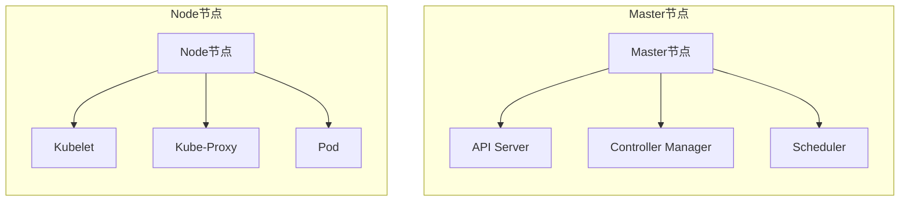
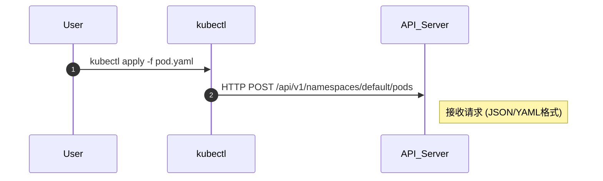
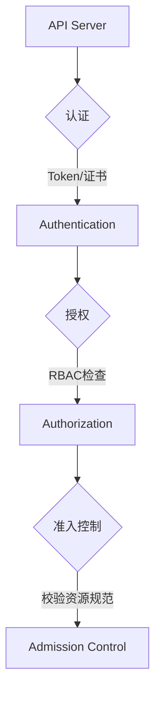
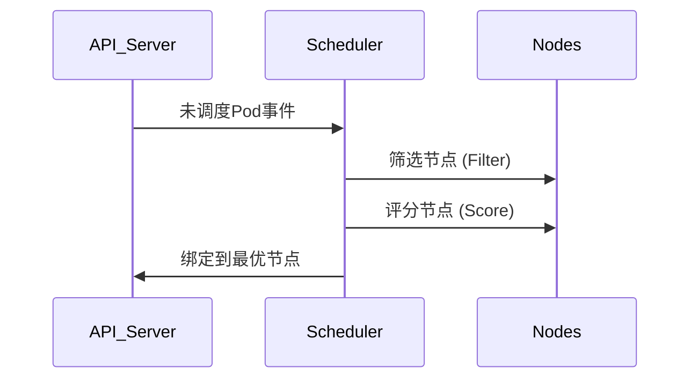
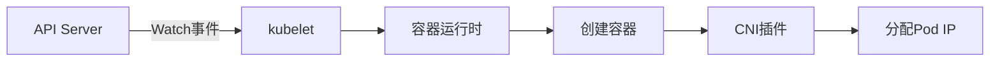
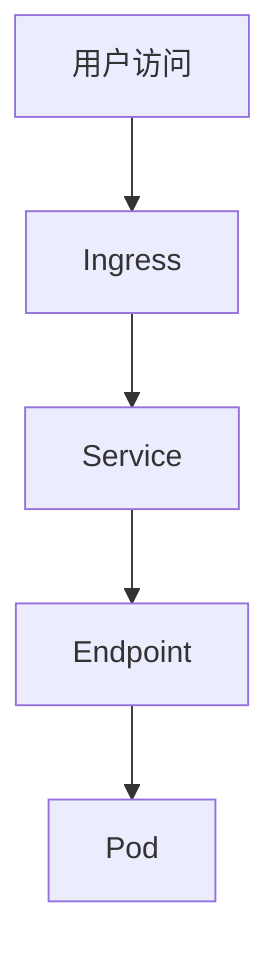

+++
date = '2026-03-30T21:28:24+08:00'
draft = false
title = 'K8s'

+++

## Docker

docker是一种轻量级容器技术,可将应用及其依赖打包成标准化单元

## Docker的优势

1. 启动快速
2. 跨平台
3. 高效运维
4. 环境一致性 (避免只有我的机器能跑)


## K8s的作用和架构

### 为什么需要k8s? 

假设现在又10个容器让你管理,管理的过来,那随着业务发展增加到1000台呢,这些容器又部署在不同的服务器上,每一个环境都不相同.那有什么办法解决这个问题?  于是k8s应运而生

### k8s的优势

1. 资源自动调度

   ```
   k8s会根据容器所需的资源扫描服务器集群,把空闲的机器部署容器,实现资源最大化
   ```

2. 负载均衡

   ```
   k8s提供一个统一的入口,不管后端容器的IP变化,都会转发到对应的容器中
   ```

3. 自动修复 

   ```
   k8s会不断检查运行状态,如果容器挂了会自动拉起一个新的,如果机器坏了,会自动迁移到其他机器上
   ```

### K8s核心组件



**Pod**

- pod是最小的可部署对象
- 它可以封装一个或者多个容器,**POD中的网络和存储,凭据共享**
- k8s不直接运行容器而是运行pod,pod中的容器一般同时运行在一台node中

**API Server:** 集群的唯一入口,所有指令优先发送到它
**node:** 实际运行容器的机器
**scheduler:**调度器,监视API Server看有没有没有分配node的POD
**Service:** 服务的固定访问入口
**Deployment:** 声明式定义应用版本与副本数
**Horizontal Autoscaler:** 根据CPU/内存自动扩缩容

## K8s POD生命周期

pod的生命周期是临时的,一旦出错就会销毁,并新建一个pod代替,所以**不可存储重要数据**

### 阶段一: 用户提交请求



用户: 用户通过定义kubectl或直接调用API提交Pod定义文件(YAML/JSON)

入口组件: API Server 是唯一入口(端口6443)

### 阶段二: API Server 鉴权流程



**RBAC** 的全称是 **Role-Based Access Control**（基于角色的访问控制）可以理解为ACL

认证步骤:

1. 认证

   TLS双向认证(证书),Bearer Token

2. 授权

   检查用户是否有创建pod的权限

3. 准入控制

### 阶段三: 调度器选择节点



调度策略详解:

1. 预选

   检查节点资源是否满足(CPU/Memory)

   匹配节点标签(如 disk=ssd)

2. 优选

   计算节点剩余资源量(BeatEFFort策略)

   检查亲和性和反亲和性规则

3. 绑定

### 阶段四: 节点创建POD



节点操作流程:

1. kubelet 监听事件

   持续监听API Server 的pod变更事件

2. 容器创建
   调用容器运行时拉取镜像

   创建容器命名空间和Cgroups限制

3. 网络配置
   CNI插件分配IP

   配置iptables/ipvs规则

4. 状态上报

### 阶段五: 服务暴露与访问



流量解析流程:

1. 用户访问
   用户访问域名
2. Ingress
   根据域名或者路径将流量分发到不同的Service
3. Service
   pod的IP是变动的,但是Service提供了一个固定的虚拟IP,它将请求发给后端的POD
4. Endpoint
   记录了后端所有的真实IP地址和端口,Service通过它连接pod.如果pod挂了,就会从名单中删除
5. pod
   到达容器内的web应用

### 基于k8s上线主节点

节点污染机制