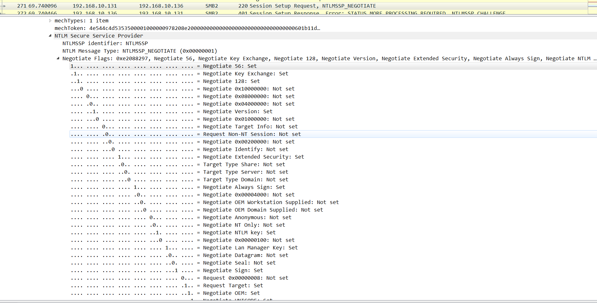
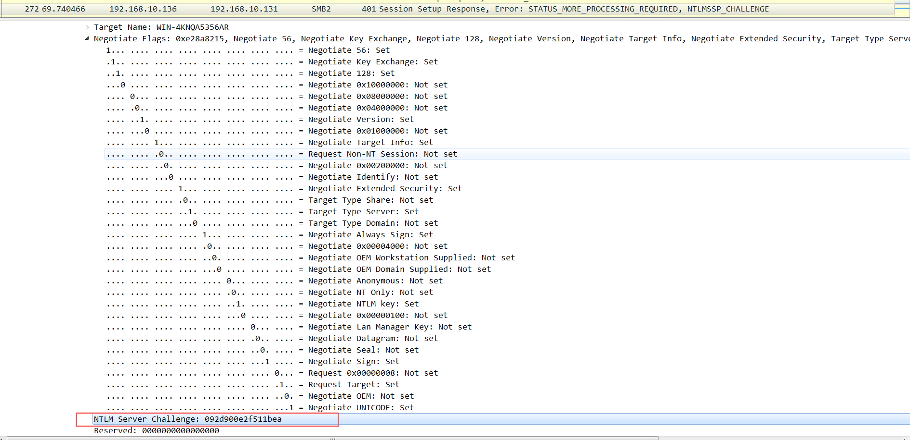
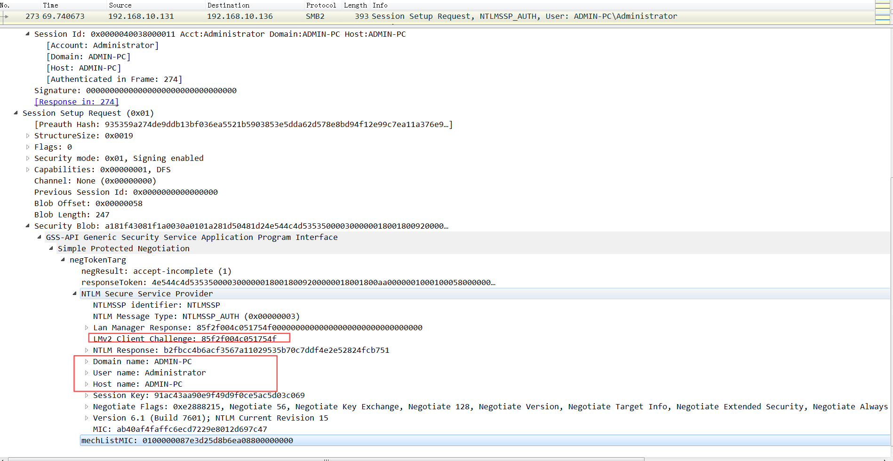
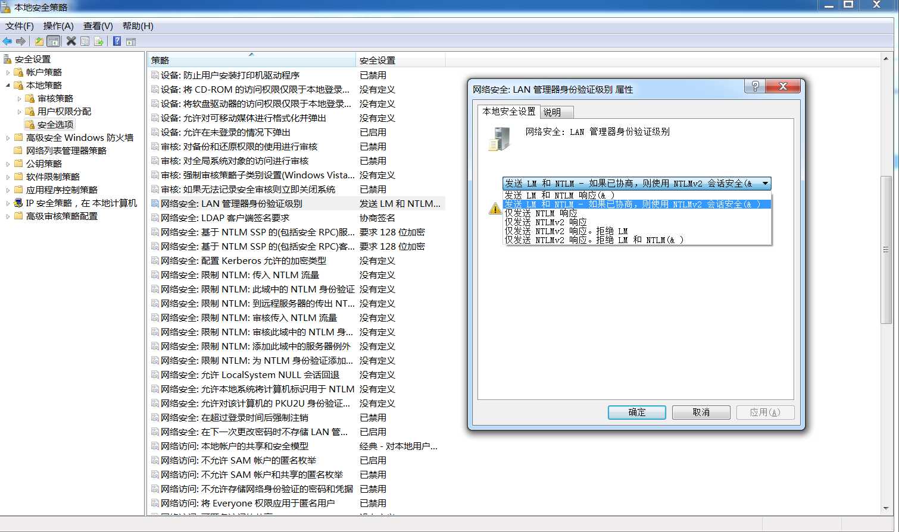
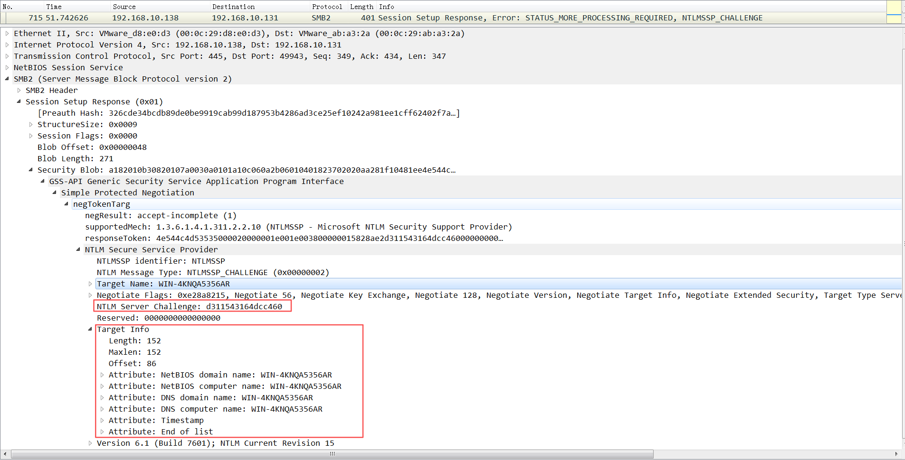
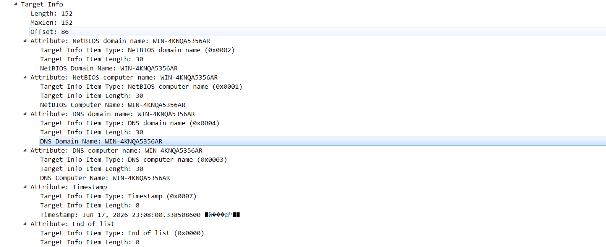

+++
date = '2026-06-13T10:46:13+08:00'
draft = false
title = 'LM,NTMLv1&v2'

+++

 `LM, NTLMv1, NTLMv2`是windows的各个版本的**网络认证协议**,用于在不传递密钥使得服务器验证用户身份

# LM

**LM**:

LM是早期windows的网络认证协议,是`Windows 3.x / 95 / 98 / Me`时期的认证协议.在Vista版本前都默认开启

**LM Hash生成流程**: 

1. 转大写 这里以`h4xk0r`为例

   ```
   h4xk0r ---> H4XK0R
   ```

2. 转换成16进制 截断/填充到14字节

   ```python
   >>> password = "H4XK0R"
   >>> print(password.encode().hex())
   48 34 58 4b 30 52
   
   结果不满足14字节,00补足
   48 34 58 4b 30 52 00 00 00 00 00 00 00 00
   ```

3. 拆分成两个7字节

   ```
   组1: 48 34 58 4b 30 52 00
   组2: 00 00 00 00 00 00 00
   ```

4. 转换成DES密钥

   ```
   将两组16进制转换成2进制
   key1: 
   1001000001101000101100001001011001100000101001000000000
   每七位一组
   组 1：0100100
   组 2：0001101
   组 3：0001011
   组 4：0000100
   组 5：1011001
   组 6：1000001
   组 7：0100100
   组 8：0000000			//不足7位补0
   
   要在每一组的最后补上 1 位，让每一组里 1 的总个数为奇数（即奇校验）
   01001001
   00011010
   00010110
   00001000
   10110011
   10000011
   01001001
   00000001
   
   合并0100100100011010000101100000100010110011100000110100100100000001  --> 转回16进制49 1A 16 08 B3 83 49 01
   
   key2:
   00000000000000000000000000000000000000000000000000000000
   因为是全零,分组就要补1如, 00000001
   最后转换成16进制后就是   --> 01 01 01 01 01 01 01 01
   
   
   ```

5. 字符串(KGS!@#$%)加密

   ```
   固定明文 =  "KGS!@#$%"  --> 16进制 = 4B 47 53 21 40 23 24 25
   cipher1 = DES(key1, "KGS!@#$%")
   cipher2 = DES(key2, "KGS!@#$%")
   
   
   cipher1 = B98A94DFC14F1E59
   cipher2 = AAD3B435B51404EE  用固定密钥去加密固定明文 结果永远相同,为此值时说明密码值不超过7位
   ```

6. 拼接输出到SAM(LM Hash)

**LM 网络认证流程(Challenge-Response)**:

LM的网络认证流程和NTLM的网络认证流程几乎一样,只是不再使用LM Hash,而是使用NT Hash


**注**: LM ≠ LM Hash : LM是认证协议,LM Hash是根据LM运算的结果

# NT Hash 

计算流程：

```
Password    123456
   ↓
UTF16LE		310032003300340035003600
   ↓
MD4			b75340b9e04c0d06fd3d3a0403a930df
   ↓
NT Hash
```

# NTLMv1

NTLM是基于挑战/应答的身份验证协议

#### **环境搭建**

Client :  Windows 7				192.168.10.131
Server : Windows Server 2008 R2	192.168.10.136

Server: 

````
共享目录：
mkdir C:\share
net share share=C:\share
````

Client

```
修改注册表
reg add HKLM\SYSTEM\CurrentControlSet\Control\Lsa ^
/v LmCompatibilityLevel ^
/t REG_DWORD ^
/d 1 ^
/f

访问
\\192.168.1.10\share
输入server账号密码
```

##### 标准认证流程

1. **NEGOTIATE:** 客户端向服务器发送请求进行协商(NEGOTIATE)

2. **CHALLENGE:** 服务器接收到请求后，生成一个8位的Challenge，发送回客户端

3. **AUth:** 客户端接收到Challenge后，使用登录用户的密码hash对Challenge加密，作为response发送给服务器

4. 服务器校验response

   

## **数据包分析:**

### **NEGOTIATE / 协商** C ---> S

目的是告诉服务器支持哪些功能

```
找到数据包NEGOTIATE数据包 --> Session Setup Request --> Security Blob --> NTLM Secure Service Provider --> NEGOTIATE Flag,根据not set 或 set判断支不支持
```



### **CHALLENGE / 质询** S ---> C

服务端生成了一个随机的 Challenge 挑战码发给客户端



### **Auth / 认证** C ---> S

客户端生成NTLM Response之后发送给服务器进行验证是否一致,不过这里工作组环境的域环境认证方式不太一致

域环境

```
1. 客户端发送质询请求给服务器
2. 服务器返回challenge值
3. 客户端计算出NT Response后返回给服务端
4. 由于是域环境服务器没有用户的密码,需要调用Netlogon协议(windows的安全认证接口),去向DC请求验证
5. DC认证成功后给服务器返回结果
```

工作组环境认证方式

```
客户端将NT Response发送给服务端后,服务端将拿到的用户名去本地SAM数据库中找到用户名对应的NT hash,然后进行计算NT Response和收到的NT Response进行对比,相同则通过
```



```
客户端计算机名 Host name
客户端质询值: LMv2 Client challenge: 85f2f004c051754f
NT质询值 NTLM Response: b2fbcc4b6acf3567a11029535b70c7ddf4e2e52824fcb751


为了防止中继攻击(前提: 开启RequireMessageSigning=1让服务器强制签名),**降级攻击**,使用会话密钥(session key)对 Type 1、Type 2、Type 3 三个包的完整内容 进行签名,值为MIC: 
MIC(消息完整性校验) MIC : 0100000087e3d25d8b6ea08800000000
加密会话密钥 Session Key: 91ac43.... 为后续的SMB读写等操作提供签名或加密
mechListMIC: 给整个认证协议选择列表做签名,如果从kerberos降级到NTML,确保操作合法
```

#### NT Response计算方式:

`Password -> MD4 -> NT Hash(16字节) -> 补零到21 Bytes -> 拆成三分 -> 每份转换DES key -> 分别加密Server Challenge --> 最后相加`

#### **NTMLv1产生的问题**

1. DES加密只有2^56种可能只要抓取到Response和Challenge就可以离线暴力破解
2. 中继攻击(NTLM Relay) : `Client --> Attacker --> Server `不能完全防止
3. 预计算攻击: 如果Challenge值固定那么攻击者可以提前建立`密码--> Response`映射表
4. 认证捕获: 服务端不用验证身份,客户端只要收到Challenge就会计算Response,攻击者可以伪造服务器发送Challenge获取Response,进行离线分析

但是MIC虽然可以防止中间人篡改进行降级攻击但是不能防止本地修改组策略(LAN Manager 身份验证级别)

```
命令secpol.msc 域环境用gpmc.msc
```



# NTMLv2

v2可以看作v1的加强版但是从架构上并没有改变,只是在type3优化了Response的生成方式, 引入**AV_PAIR(TargetInfo)**元数据

## Type2   S ---> C



### v2 Response的生成方式:

````
NTLMv2 Response =  NTProofStr + Blob
````

------

#### NTProofStr的生成方式: 

```
NTProofStr
=
HMAC-MD5(
    key = NTLMv2 Hash,
    msg = ServerChallenge + Blob
)
```

##### NTMLv2 Hash生成方式: 

1. 拿到客户端密码后生成NT Hash,即`MD4(UTF16LE(password))`

2. 用户名转大写加上domain name, 域环境则`CORP\Administrator --> ADMINISTRATORCORP`

3. 生成NTMLv2 Hash

   ```
   NTLMv2 Hash
   =
   HMAC-MD5(
       key = NT Hash,
       msg = UsernameUpper + Domain
   )
   ```

#### Blob的计算方式:

Blob结构: 

```
Blob
├─ RespType			对应图中Response Version --> 01
├─ HiRespType		对应 Hi Response Version --> 01
├─ Reserved1		固定值 00 00
├─ Reserved2		固定值 00 00 00 00
├─ Timestamp		
├─ ClientChallenge
├─ Reserved3		固定值00 00 00 00
├─ AV_PAIR
├─ Terminator

Reserved 1-3为隐藏值不显示
```

1. 获得Blob Header

   ```
   RespType      = 0x01
   HiRespType    = 0x01
   Reserved1     = 0x0000
   Reserved2     = 0x00000000
   
   得到固定值 0101000000000000
   ```

2. 获取时间

   避免v1出现的重放攻击

   ```
   Unix使用1970-01-01 00:00:00 UTC做起点 Windows用1601-01-01 00:00:00 UTC
   单位是100纳秒(100ns) 1秒 = 10000000 个 FILETIME单位
   
   windows为例:
   1.调用GetSystemTimeAsFileTime()得到时间,计算起始时间到现在多少秒
   2. 乘 10000000 得到的结果 转换成16进制
   3. 按照小端存储
   4. 写入Blob
   
   得到时间值
   ```

3. 生成client challenge

   ```
   生成随机数: 
   老版本使用CryptGenRandom() 新版BCryptGenRandom()
   
   获得69ca37de63c89d37
   ```

4. 添加 Reserved3 --> (00000000) 

5. 获取AV_PAIR(TargetInfo)

   

   ```
   获取TargetInfo进行编码:
   AV_PAIR = Type(2字节) + Length(2字节) + Value(Length字节)
   
   以domain name举例: 
   type = 0x0002
   Length = WIN-4KNQA5356AR 15字符 --> 30字节0x001E --> 0x001E --> 小端1E 00
   Value = UTF-16LE(WIN-4KNQA5356AR)
   
   Timestamp: 
   Type = MsvAvTimestamp
   Length = 8
   value = 转换成TiMEFILE --> 小端存储
   
   MsvAvEOL固定值没有Value: 
   00 00
   00 00
   ```

6. 合并

   ```
   Blob = 固定头 + 时间 + client challenge + AV_PAIR + 结束标记
   ```

#### NTMLv1 && NTMLv2总结: 

优化: 

1. v2更改了加密方式加入了Blob,提高了暴力破解的难度
2. 增加了Client challenge 和时间防止重放攻击
3. 增加AV_PAIR绑定目标环境一定程度防止中继攻击

但是依然存在以下等问题: 

1. 抓取到`ServerChallenge, Blob, NTProofStr`依然可以离线爆破密码
2. 仍然可以被中继攻击
3. 攻击者可以冒充服务器收集response
4. ...

所以出现了Kerberos,下文再说吧 ....


------

“受限于个人水平，文中难免存在疏漏与错误。文笔粗浅、技术简陋，若有不足之处，恳请各位师傅批评指正，不吝赐教。感激不尽！”
