+++
date = '2026-05-14T19:38:41+08:00'
draft = false
title = '蜜罐及反制技术'
+++

蜜罐是一种主动防御技术,它通过故意暴露的漏洞或者敏感信息,诱导黑客进行攻击,增加攻击者的攻击成本并对攻击者的攻击方式进行分析,溯源等以便更好的防御的一种手段.

## 蜜罐的分类

蜜罐从低到高分为低交互蜜罐,中交互蜜罐,高交互蜜罐以及蜜罐集群组成的蜜网

#### 低交互蜜罐:

只提供特定服务,通过脚本或者程序模拟协议的行为实现. 虽然不够仿真,但是成本低,也具备捕获攻击者IP,载荷等信息的能力

#### 中交互蜜罐:

中交互蜜罐可以模拟一个相对完整的应用环境,但是不具备真实的操作系统内核,是进程级的服务模拟.可以提供更完整的攻击交互,如文件上传,注入等模拟执行成功后的结果

#### 高交互蜜罐:

高交互蜜罐是基于真实的操作系统和服务构建的.通常在虚拟机或者沙箱中.攻击者拿到的是shell权限.但是如果防护不到位攻击者可能会以此为跳板攻击真实的内网机器.成本极高.用于捕获APT攻击等

#### 蜜网

蜜网实际上是有多个蜜罐组成的集群.构成:
**Honeywall(蜜罐网关):** 负责控制流量,防止攻击者逃逸和捕获数据

**蜜罐集群:** 包含多种蜜罐

**Honeytoken:** 散布在网络中的诱饵信息,如数据库账号密码等.用于引诱攻击者下一步进攻


## 蜜罐反制

### web蜜罐反制

1. jsonp劫持: 蜜罐前端会内置大量的主流网站(Google,GitHub等)的jsonp接口,只要当前的浏览器登陆过这些网站,蜜罐通过跨域请求就能够直接拿到你的账号信息,或者浏览器,屏幕等硬件信息.

2. 通过留下诱饵信息,如数据库的连接账户密码等,让攻击者进行连接,从而进行数据库蜜罐反制,或者进入蜜网等
3. 通过网站的合理交互功能,如填写手机号或者个人信息,获取攻击者的信息

### MySQL数据库蜜罐反制

**成因:** `LOAD DATA LOCAL INFILE`机制: 可以将本地文件发送到数据库中

正常使用: 客户端输入 `LOAD DATA LOCAL INFILE '/etc/passwd' INTO TABLE users;`，客户端驱动就会读取本地的 `/etc/passwd` 并发给服务器

蜜罐使用: 当你通过投下的诱饵连接数据库时,蜜罐服务器会在握手成功后或者执行命令的时候主动向客户端发送文件请求的数据包,将攻击者的文件拿到手,一些常见的抓取文件:

```
Windows 路径：
C:/Users/Administrator/AppData/Roaming/Tencent/WeChat/All Users/config/config.data（获取微信基本信息）
C:/Users/Default/AppData/Local/Google/Chrome/User Data/Default/Login Data（Chrome 凭据）

Linux 路径：
~/.ssh/id_rsa（SSH 私钥）
~/.bash_history（历史命令，可能包含敏感密码或其它跳板 IP）
```


## 攻击方反制手段

1. 存储型XSS:

   蜜罐可以将攻击者的个人信息或者攻击载荷等展示出来如:`Username` ,`User-Agent`等,可以在攻击的时候在这些地方插入payload,对防守方进行反制

2. 攻击者下载文件植入木马后传回去,当防守方直接打开后就会中招

3. 在防守方下载文件之前,替换重要文件如微信的`config.data`文件,替换成钓鱼凭证,当防守方查看时就会触发

4. 蜜罐N-day

   防守方的管理系统存在N-day或者使用的插件等存在N-day等

   

## 蜜罐特征([转](https://mp.weixin.qq.com/s?biz=Mzk0NzE4MDE2NA==&mid=2247483908&idx=1&sn=e6a319e22c3cd54650bdbba511e58a43))

- **3.1 协议的返回特征**

  部分开源蜜罐在模拟各个协议时，会在响应中带有一些明显的特征，可以根据这些特征来检测蜜罐。

  拿Dionaea 的Memcached协议举例，在实现Memcached协议时Dionaea把很多参数做了随机化，但是在一些参数如：version、libevent和rusage_user等都是固定的。

  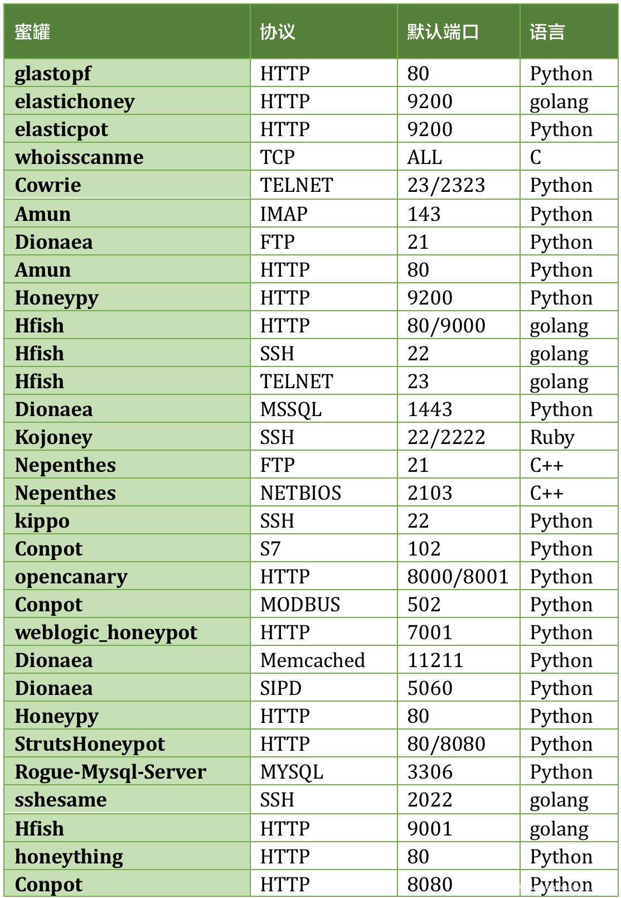

  可以通过组合查询其固定参数来确定蜜罐，其他蜜罐在协议上的特征如表3-1所示。

  表3-1 协议响应特征的蜜罐

  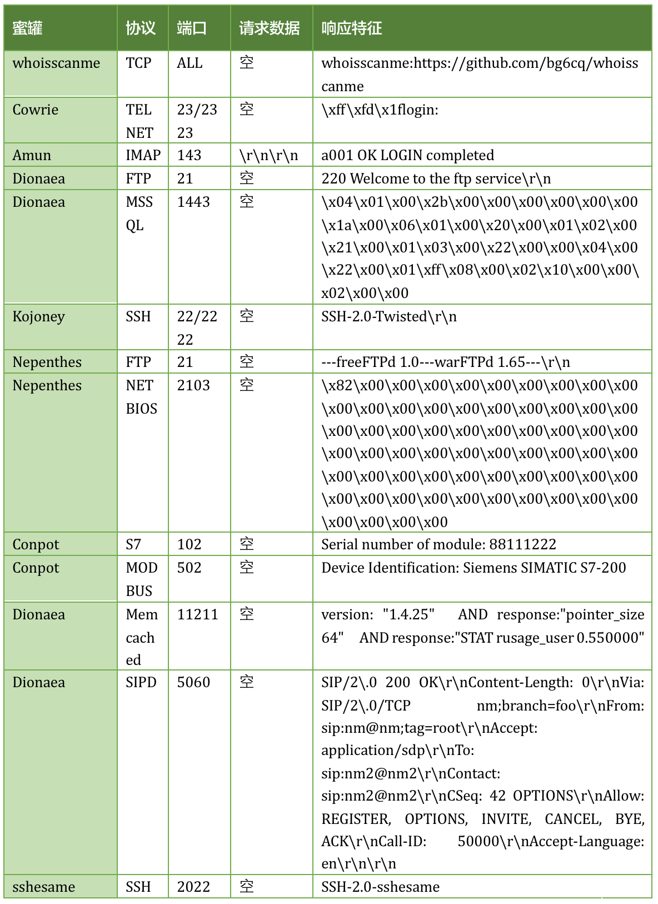

  

  ### **3.2 协议实现的缺陷**

  在部分开源的蜜罐中模拟实现部分协议并不完善，我们可以通过发送一些特定的请求包获得的响应来判断是否为蜜罐。

  

  #### **3.2.1 SSH协议**

  SSH协议（Secure Shell）是一种加密的网络传输协议，最常用的是作为远程登录使用。SSH服务端与客户端建立连接时需要经历五个步骤：

  - 协商版本号阶段。
  - 协商密钥算法阶段。
  - 认证阶段。
  - 会话请求阶段。
  - 交互会话阶段。

  SSH蜜罐在模拟该协议时同样要实现这五个步骤。Kippo 是一个已经停止更新的经典的SSH蜜罐，使用了twisted来模拟SSH协议。在kippo的最新版本中使用的是很老的twistd 15.1.0版本。该版本有个明显的特征。在版本号交互阶段需要客户端的SSH版本为形如SSH-主版本-次版本 软件版本号，当版本号为不支持的版本时，如SSH-1.9-OpenSSH_5.9p1就会报错“bad version 1.9”并且断开连接。通过Kippo的配置来看，仅仅支持SSH-2.0-X和SSH-1.99-X两个主版本，其他主版本都会产生报错。

  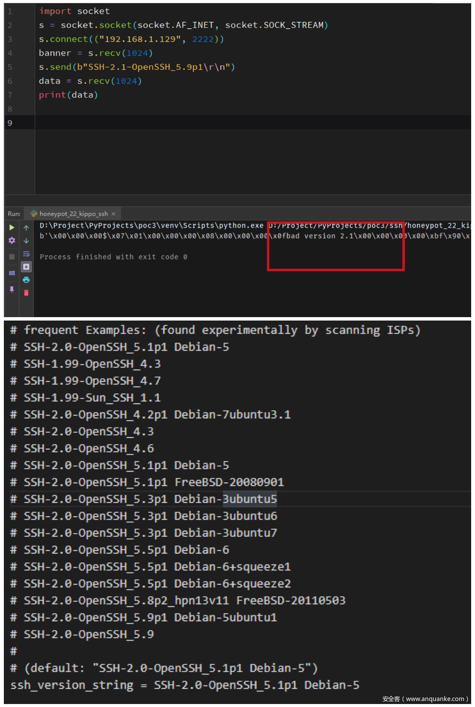

  

  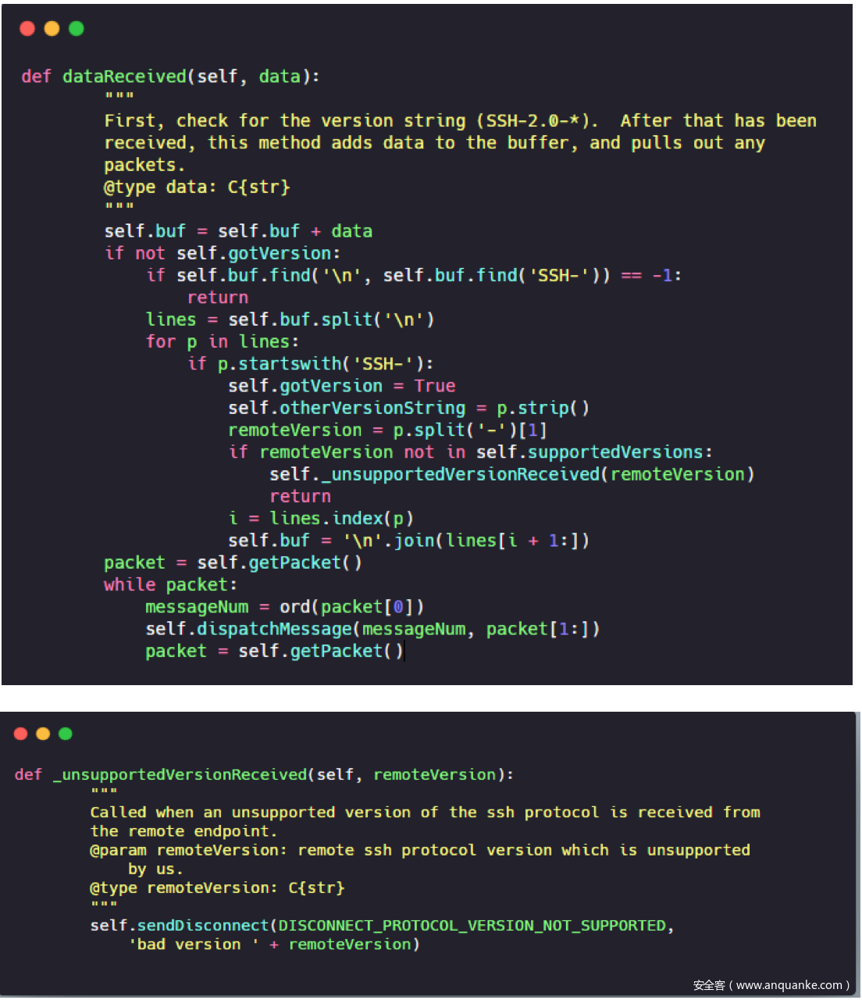

  

  #### **3.2.2 Mysql协议**

  部分Mysql蜜罐会通过构造一个恶意的mysql服务器，攻击者通过连接恶意的mysql服务器后发送一个查询请求，恶意的mysql服务器将会读取到攻击者指定的文件。

  

  最早的如***https://github.com/Gifts/Rogue-MySql-Server\***，可以伪造一个恶意的mysql服务器,并使用mysql客户端连接，如下图可见恶意的mysql服务器端已经成功读取到了客户端的/etc/password内容。

  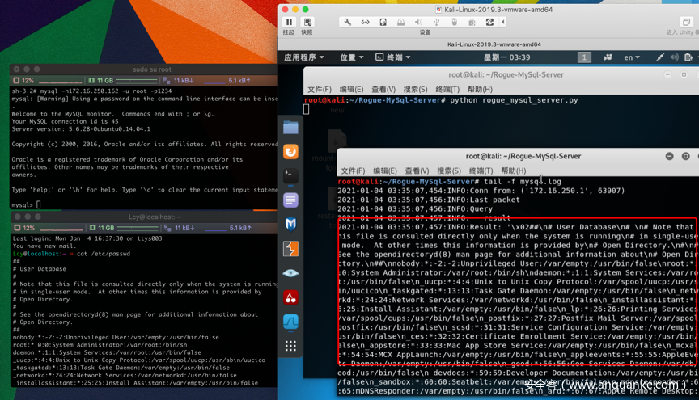

  检测此类蜜罐的步骤可分为如下几步：

  1. 伪造客户端连接蜜罐mysql服务
  2. 连接成功发送mysql查询请求
  3. 接受mysql服务器响应，通过分析伪造的mysql客户端读取文件的数据包得到的报文结构：文件名长度+1 + \x00\x00\x01\xfb + 文件名

  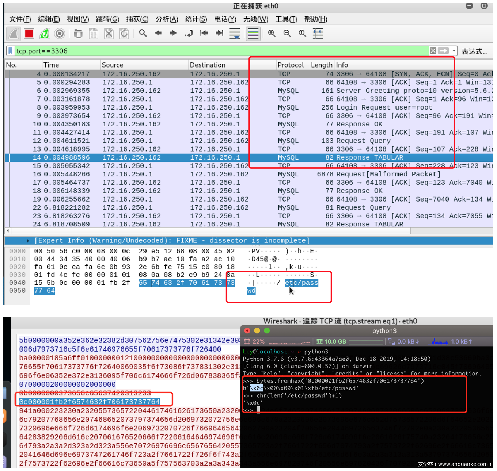

  那么我们就可以通过socket构造对应的流程即可识别伪造的mysql服务器，并抓取读取的文件名。

  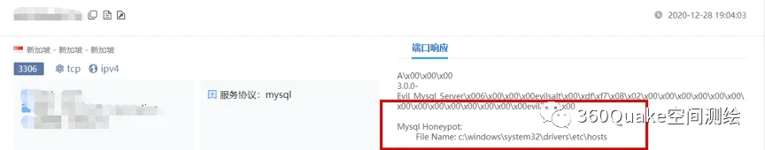

  ####  

  #### **3.2.3  Telnet协议**

  HFish蜜罐中实现了Telnet协议，默认监听在23端口。模拟的该协议默认无需验证，并且对各个命令的结果都做了响应的模板来做应答。在命令为空或者直接回车换行时，会响应default模板，该模板内容为test。因此可以利用这个特征进行该蜜罐在telnet服务上的检测如图所示。

  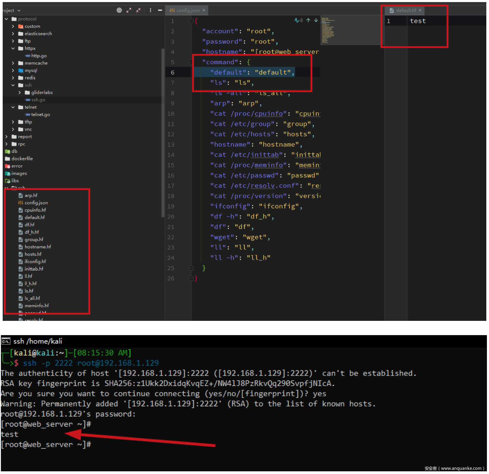

  

  ###  

  ### **3.3 明显的WEB的特征**

  部分开源蜜罐提供了web服务，这些web服务中常常会带有一些明显的特征，可以根据这些特征来检测蜜罐。如特定的js文件、build_hash或者版本号等。

  

  还是拿HFish举例。HFish在默认8080端口实现了一个WordPress登录页面，页面中由一个名为x.js的javascript文件用来记录尝试爆破的登录名密码。直接通过判断wordpress登录页是否存在x.js文件就可判断是否为蜜罐。

  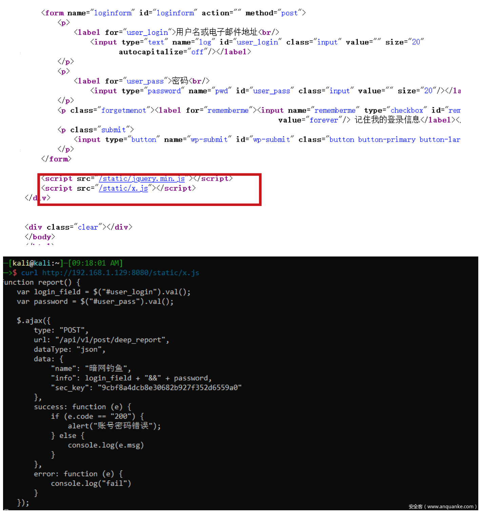

  

  还有glastopf蜜罐，其没做任何伪装是最明显的。可以通过页面最下方的blog comments的输入框进行识别。

  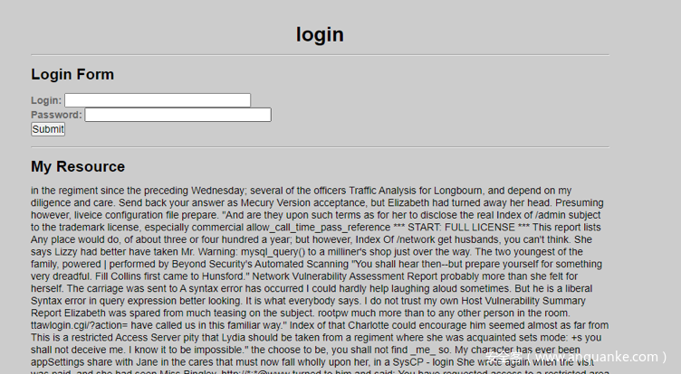

  

  其他的常见的开源蜜罐在WEB上的特征如下表所示。

  表3-2 具有明显WEB特征的蜜罐

  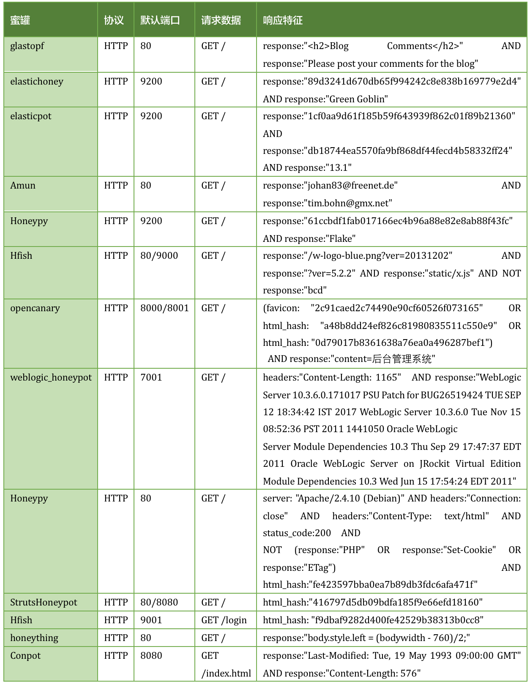

  

  ### **3.4 上下文特征**

  部分开源蜜罐存在命令执行上下文明显的特征，本节以Cowrie和HFish为例。

  

  2020年6月份研究人员发现Mirai的新变种Aisuru检测可以根据执行命令的上下文检测到Cowrie开源蜜罐。当满足如下三个条件时Aisuru将会判定为蜜罐：

  - 设备名称为localhost。
  - 设备中所有进程启动于6月22日或6月23日。
  - 存在用户名richard。

  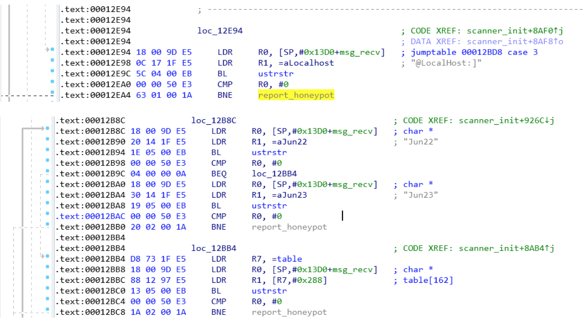

  

  查看Cowrie源码在默认配置中执行ps命令，发现进程的启动时间都在6月22或6月23。不过在最新版的Cowrie中richard被phil替换，并且主机名由localhost替换为svr04。

  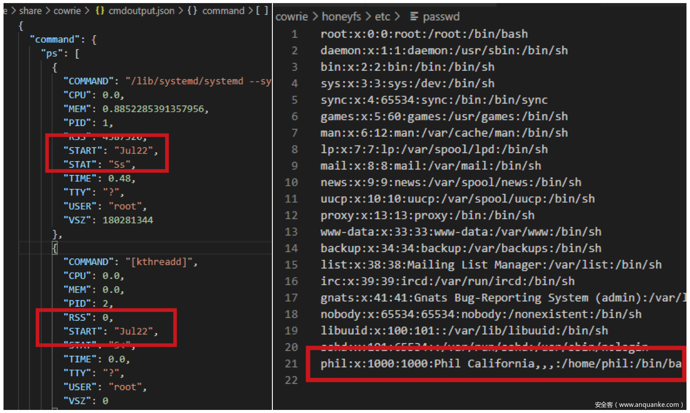

  

  由Aisuru的启发，是可以根据一些特定的上下文来检测蜜罐的。比如最新版的Cowrie，在默认配置下一些一些命令得到的结果是固定不变的。如：cat /proc/meminfo 这个命令无论执行多少次得到的内容都是不变的，而这真实的系统中是不可能的。

  

  再说HFish蜜罐，HFish同样也实现了SSH协议，默认监听在22端口。该蜜罐的SSH协议同样可以很容易的通过上下文识别出来。和telnet协议一样SSH协议在直接进行回车换行时会默认执行default输出test。

  

  

  ### **3.5 Fuzz testing 特征**

  Fuzz testing（模糊测试）本是一种安全测试的方法，通过产生随机的数据输入测试系统查看系统响应或者状态，以此发现潜在的安全漏洞。部分蜜罐借用Fuzz testing的思想实现了蜜罐系统，通过360 Netlab的 zom3y3大哥在《通过Anglerfish蜜罐发现未知的恶意软件威胁》中对Fuzz testing蜜罐的介绍，我们得知有以下几点特征：

  - 响应任意端口的TCP SYN Packet。
  - 根据协议特征，永远返回正确的响应。
  - 返回预定义或者随机的Payload特征库集合。

  

  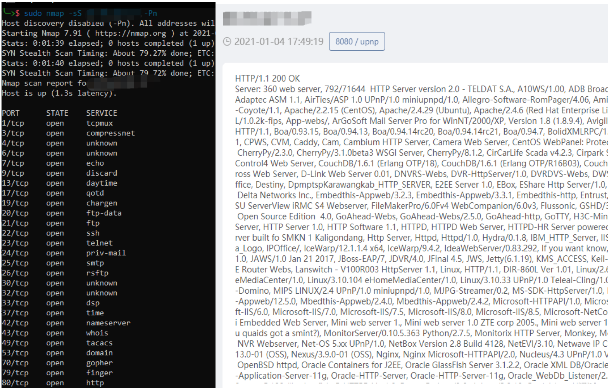

  该蜜罐很容易通过人工判断，其目的为模拟蜜罐fuzzing特征，通过预定义大量的关键字实现对扫描器的干扰。该类蜜罐可以通过跨服务的特征进行判断，如开放了HTTP服务同时响应了upnp协议，或者根据server的长度或者个数来判断。由于未知哪种蜜罐产品提供的这个蜜罐服务，quake将此蜜罐标记为未知蜜罐，可以使用语法app:"未知蜜罐"搜索。


------

“受限于个人水平，文中难免存在疏漏与错误。文笔粗浅、技术简陋，若有不足之处，恳请各位师傅批评指正，不吝赐教。感激不尽！”
