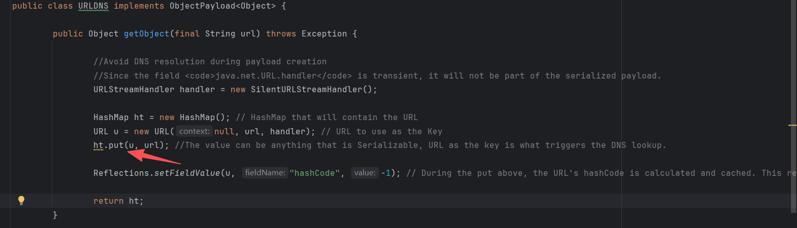
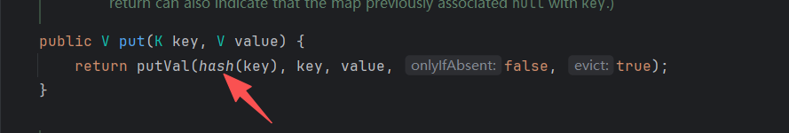
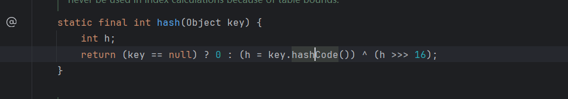
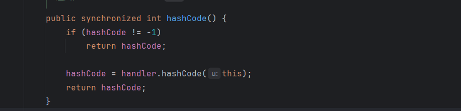
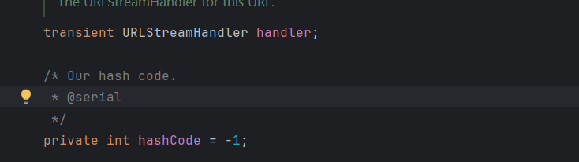
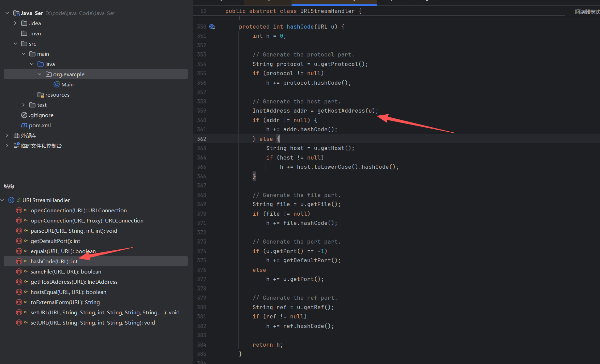

+++
date = '2026-10-07T12:54:57+08:00'
draft = false
title = '反序列化链(URLDNS)'
+++

该链使用Java内置类. 所有有几个特性:

- 不依赖第三方
- 不限制 JDK 版本

又因为该链只能触发 DNS 请求所以常用来探测是否存在反序列化漏洞.

### 分析

漏洞的利用链条在yso中是这样写的

```
*   Gadget Chain:
*     HashMap.readObject()
*       HashMap.putVal()
*         HashMap.hash()
*           URL.hashCode()
```

找到`src/main/java/ysoserial/payloads/URLDNS.java`



注意到`HashMap `的put方法接收一个域名. 跟进 put 方法,



调用了`putVal`. 并对第一个参数调用了 hash 方法,继续跟进`hash()`



判断接收的`Key`是否为 null , 否的话调用key的`hashcode`方法.

注意: 如果这里接收的值是 url 的话,就会调用 url 的`hashcode`方法,写一个demo来看URL中的`hashcode`方法

```java
public class Main {
    public static void main(String[] args) {
        URL url  = null;	
    }
}
```

进入URL,查看 `hashcode()`



判断不等于`-1`, 因为这里默认值是等于`-1`的,所以执行`handler.hashcode`,跟进一下`URLStreamHeadler`



继续跟进



发现是调用的`getHostAddress() `获取域名的IP地址.也就是说会进行DNS解析. 也就可以通过是否接收到DNS来验证是否存在反序列化

### 总结

HashMap 在反序列化、重新计算 key 的 hash 时，如果 key 是 URL，就会调用 `URL.hashCode()`；URL 的 hash 计算过程中会获取主机地址，从而可能触发 DNS 查询。


------

“受限于个人水平，文中难免存在疏漏与错误。文笔粗浅、技术简陋，若有不足之处，恳请各位师傅批评指正，不吝赐教。感激不尽！”
